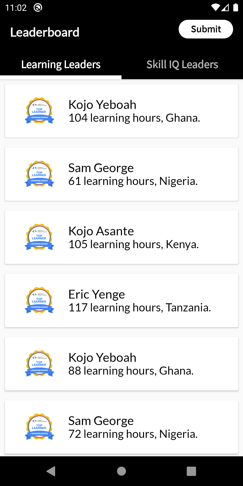
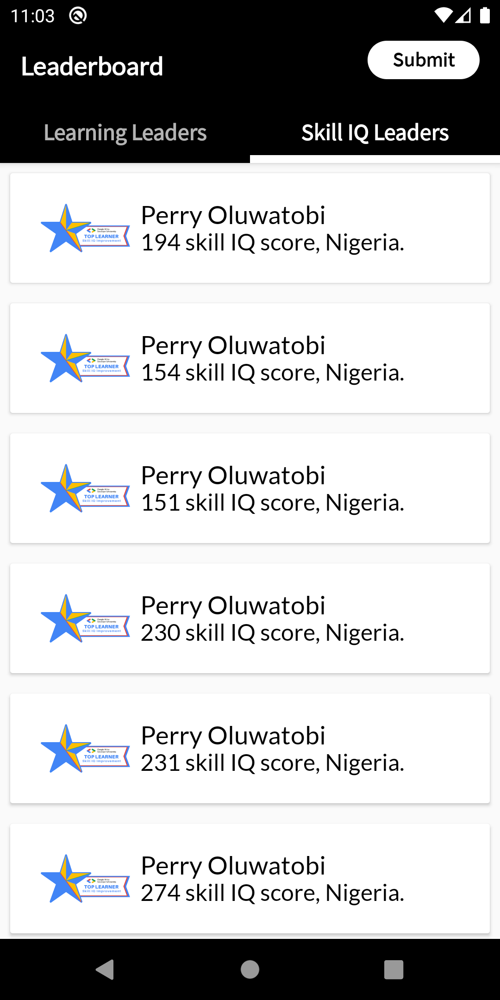
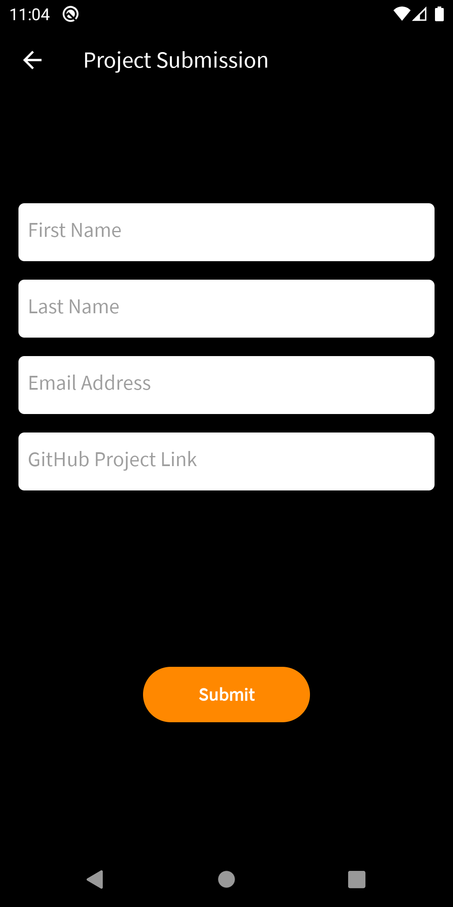

# GADS Leaderboard

This project is a very simple Android app project that allowed us to implement some simple concepts related to Android Development. It implements a mobile design of the GADS 2020 Leaderboard and displays the top 20 learners in the Learning Leaders’ category and the top 20 learners in the Skill IQ Leaders’ category.

